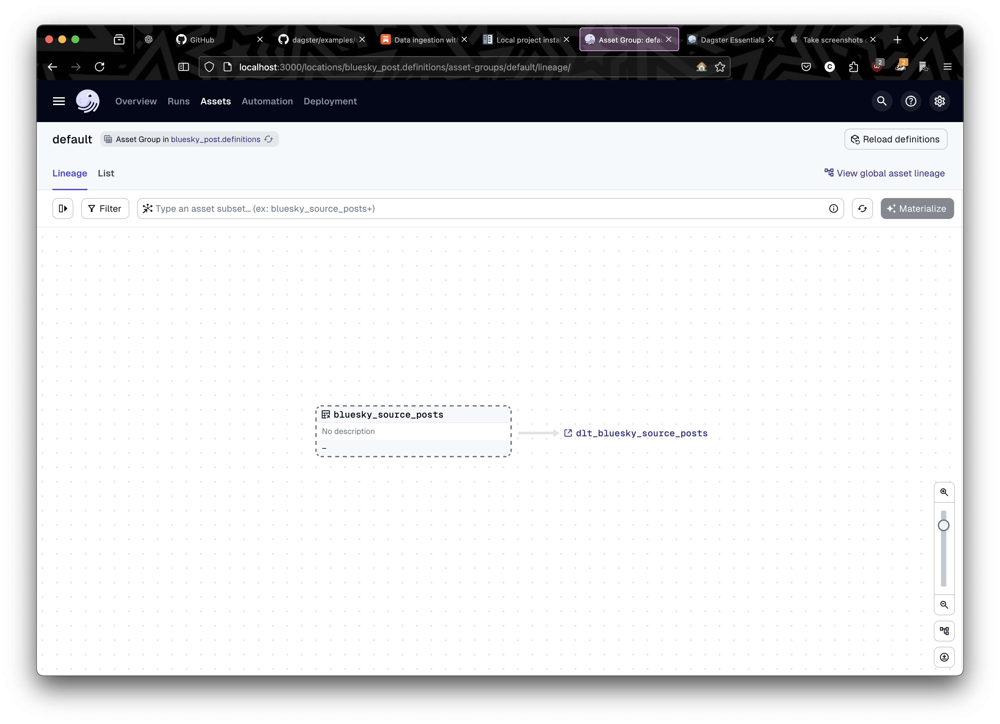

# Bluesky-post API

Personal project building a data pipeline using Bluesky's public API to AWS S3, deployed using Dagster. I used `dlt`, an open-source Python library, to extract and load data from Bluesky's API endpoint, and Dagster to orchestrate the pipeline.

## Tools

### [dlt](https://dlthub.com/docs/intro)

dlt is an open-source Python library that loads data from various, often messy data sources into well-structured, live datasets. It offers a lightweight interface for extracting data from REST APIs, SQL databases, cloud storage, Python data structures, and more.

dlt is designed to be easy to use, flexible, and scalable:

- It infers schemas and data types, normalizes the data, and handles nested data structures.
- It supports a variety of popular destinations and has an interface to add custom destinations to create reverse ETL pipelines.
- It can be deployed anywhere Python runs, be it on Airflow, serverless functions, or any other cloud deployment of your choice.
- It automates pipeline maintenance with schema evolution and schema and data contracts.

### [Dagster](https://docs.dagster.io/getting-started)

Dagster is an orchestrator designed for developing and maintaining data assets, such as tables, datasets, machine learning models, and reports.

You declare functions that you want to run and the data assets that those functions produce or update. Dagster then helps you run your functions at the right time and keep your assets up to date.

Dagster is designed to be used at every stage of the data development lifecycle, including local development, unit tests, integration tests, staging environments, and production.

## Python Configuration

As with every new project, we create a virtual environment and add the Python version we want to develop with. I'm using Python version 3.12 for this project.

1. **Install Python 3.12**

```bash
brew install python@3.12
```

2. **Create a new virtual environment**

```bash
python3.12 -m venv .venv
```

3. **Activate the virtual environment**

```bash
source .venv/bin/activate
```

4. **Install the required packages from `requirements.txt`**

```bash
pip install -r requirements.txt
```

The package listed in the `.txt` file contains various prerequisites and is intended to be used in conjunction with AWS, which is exactly what we need.

Once the installation is complete, ensure you are in the correct project directory and run the following command:

```bash
dlt init rest_api filesystem
```

This command will create a project scaffolding, keeping our assets well-organized. The `.dlt` directory contains key files used to configure different parameters:

- `secrets.toml`: Stores the necessary credentials required to access my personal AWS account.
- `config.toml`: Used for configuring the pipeline.

Also included in the scaffolding is a template python api file that after a few changes we can use as our own! After my own revisions the end result was as follows:

```python
from datetime import datetime, timedelta
from typing import Any
import dlt
from dlt.sources.rest_api import (RESTAPIConfig,  # type: ignore
                                  rest_api_resources)


# Funtion to calculate date range
def get_date_range() -> tuple[str, str]:
    """
    Calculates date range for the API call
    Returns
    tuple:since, until
    """

    yesterday = datetime.now() - timedelta(days=1)

    since = yesterday.replace(hour=0, minute=0, second=0,
                              microsecond=0).isoformat() + 'Z'
    until = yesterday.replace(hour=23, minute=59, second=59,
                              microsecond=999999).isoformat() + 'Z'

    return since, until


# Define the Bluesky posts resource
@dlt.source
def bluesky_source() -> Any:
    """
    Configure the API call
    """

    since, until = get_date_range()

    # Define RESTAPIConfig for Bluesky API
    config: RESTAPIConfig = {
        "client": {"base_url": "https://public.api.bsky.app/xrpc/"},
        "resources": [
            {
                "name": "posts",
                "endpoint": {
                    "path": "app.bsky.feed.searchPosts",
                    "params": {
                        "q": "data engineer",  # Search term
                        "sort": "latest",
                        "since": since,
                        "until": until,
                        "tag": ["dataBS", "datasky"],
                        "limit": 100,
                    },
                },
            },
        ],
    }

    # Generate resources using RESTAPIConfig
    yield from rest_api_resources(config)


def create_pipeline() -> Any:
    """
    Create and configure the pipeline
    """
    pipeline = dlt.pipeline(
        pipeline_name="blueskyAPI",
        destination="filesystem",
        dataset_name="blueskyData",
        progress="log",
    )
    return pipeline


# Set pipeline variable
pipeline = create_pipeline()
# Run the pipeline
load_info = pipeline.run(bluesky_source())
print(load_info)

```

## Orchestration

Good orchestration is absolutely key for any quality data pipeline. A well-orchestrated pipeline will be automated, ensuring clean, high-quality data at a consistent time. It should be scalable and efficient, helping to keep costs low and trust in the data high. It will have minimal manual interventions and robust error handling. Dagster provides all that and more.

```bash
mkdir dagster_bluesky_posts
cd dagster_bluesky_posts
dagster project scaffold
```

The `dagster project scaffold` command generates the default folder structure, including essential files like `pyproject.toml` and `setup.py`, providing a starting point for our pipeline.

**IMPORTANT:**
Move the `.dlt` directory into the `bluesky_post` directory to ensure that the `dlt` library has access to all the necessary objects needed to run the pipeline.

The final step is to configure the pipeline, and Dagster comes with an easy-to-use GUI! Simply run:

```bash
pip install -e "[.dev]"
```

in the first directory named `bluesky_post`, not the second! Once installed, run:

```bash
dagster dev
```

This command will launch a nice little web interface where you can configure the pipeline visually.


